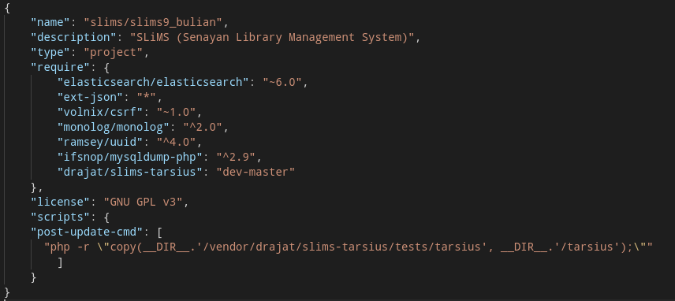

# SLiMS Tarsius (paket ini ditinggalkan dan ditingkatkan ke zein/tarius)

Sebuah perkakas untuk [SLiMS](https://github.com/slims/) yang digunakan sebagai *code generator* seperti membuat kerangka dasar dari plugin, template, modul, library, dan rest-api.

### Cara pasang
* Buka konsol kesangan anda seperti, cmd, terminal, powershell dll
* Pastikan anda sudah memasang [composer](https://getcomposer.org/download/).
* Pastikan anda menggunakan SLiMS sekurang nya versi 9.3.0
* Masuk kedalam folder SLiMS anda.
* Buka file composer.json
* lalu tambahkan skrip berikut seperti berikut
  >     "scripts": {
  >         "post-update-cmd": [
  >         "php -r \"copy(__DIR__.'/vendor/drajat/slims-tarsius/tests/tarsius', __DIR__.'/tarsius')\""		
  >         ]	
  >     }
  dibawah "license": "GNU GPL v3",
  seperti berikut :
  
* Kembali ke terminal/shell anda lalu ketikan perintah seperti berikut 
  > **composer require drajat/slims-tarsius**

### Cara menggunakan
Ketikan perintah seperti berikut untuk dokumentasi nya:
> php tarsius --help
